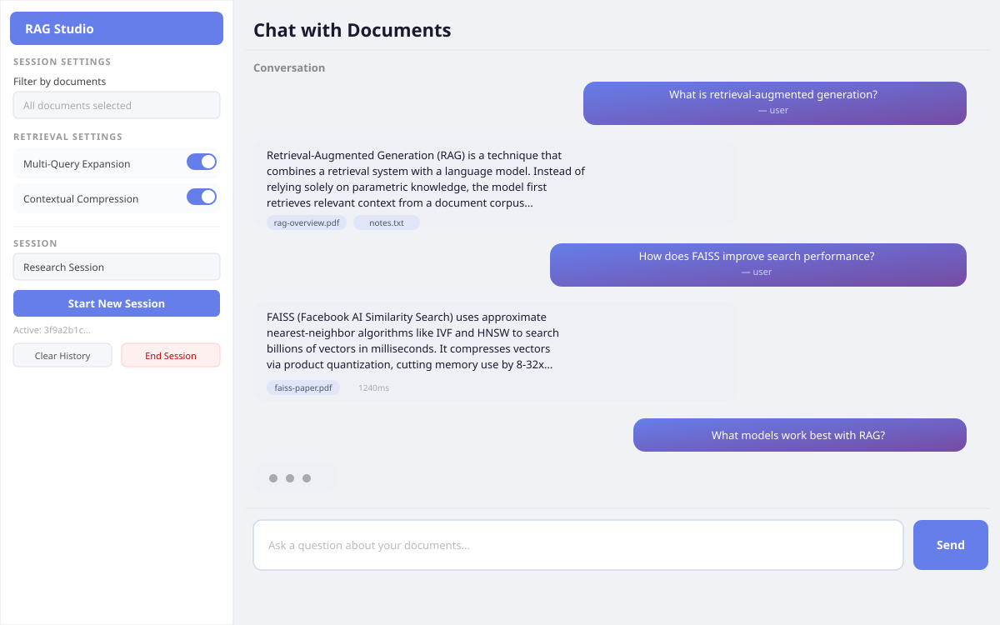
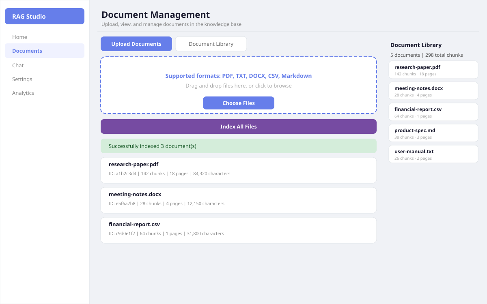
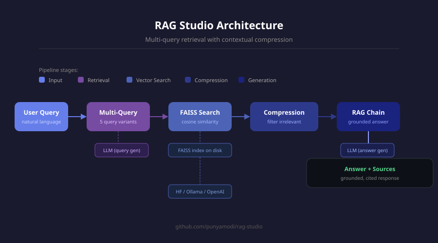

# RAG Studio

> Production-ready Retrieval-Augmented Generation platform — FAISS vector search, multi-query retrieval, contextual compression, and a full Streamlit web UI.

---



---

## Overview

RAG Studio turns any collection of documents into an interactive knowledge base. Upload PDFs, Word docs, CSVs, or plain text, then ask questions in natural language and get grounded answers with source citations — running fully locally via Ollama or through OpenAI.

The pipeline goes beyond a basic similarity search:

1. **Multi-query expansion** — the LLM rewrites your question into multiple variants to maximise recall
2. **FAISS vector search** — cosine similarity over all variants at once
3. **Contextual compression** — the LLM strips irrelevant content before constructing the final context
4. **Grounded generation** — the answer is built from retrieved passages, with source citations attached

---

## Screenshots

### Chat Interface



### Document Management



### Architecture



---

## Architecture

```
User Query
    │
    ▼
Multi-Query Expansion  ─────  LLM generates 5 query variants
    │
    ▼
FAISS Vector Search  ──────  Cosine similarity over all variants
    │
    ▼
Contextual Compression  ────  LLM filters noise from chunks
    │
    ▼
RAG Chain  ─────────────────  LLM generates grounded answer
    │
    ▼
Response + Source Citations
```

```
rag-studio/
├── app/
│   ├── config.py                  Pydantic-settings configuration
│   ├── core/
│   │   ├── document_processor.py  PDF/DOCX/TXT/CSV/MD ingestion & chunking
│   │   ├── embeddings.py          HuggingFace / Ollama / OpenAI embeddings
│   │   ├── vectorstore.py         FAISS index management
│   │   ├── retriever.py           Multi-query + contextual compression retriever
│   │   ├── chain.py               RAG chain with conversation history
│   │   ├── llm.py                 Ollama / OpenAI LLM abstraction
│   │   └── session.py             Persistent chat session management
│   └── api/
│       ├── main.py                FastAPI application factory
│       ├── dependencies.py        Dependency injection
│       ├── models.py              Pydantic request/response schemas
│       └── routes/
│           ├── documents.py       Upload, list, delete documents
│           ├── query.py           Query and similarity search endpoints
│           ├── sessions.py        Session CRUD
│           └── health.py          Health check
├── ui/
│   ├── Home.py                    Streamlit home / dashboard
│   └── pages/
│       ├── 1_Documents.py         Document upload and library
│       ├── 2_Chat.py              Interactive Q&A with history
│       ├── 3_Settings.py          LLM, embedding, retrieval config
│       └── 4_Analytics.py         Usage analytics dashboard
├── tests/
│   ├── test_document_processor.py
│   ├── test_session.py
│   └── test_api.py
├── storage/                       Local document and index storage
├── docs/images/                   UI screenshots
├── requirements.txt
└── .env.example
```

---

## Features

- **Multi-format ingestion** — PDF, DOCX, TXT, CSV, Markdown
- **FAISS vector index** — local similarity search, no external vector DB required
- **Multi-query retrieval** — LLM expands your query into 5 variants for higher recall
- **Contextual compression** — filters irrelevant chunks before the LLM sees them
- **Conversation history** — sessions remember previous turns for follow-up questions
- **Dual LLM support** — Ollama (fully local) or OpenAI, switchable via `.env`
- **Three embedding backends** — HuggingFace sentence-transformers, Ollama, or OpenAI
- **REST API** — FastAPI backend with auto-generated OpenAPI docs at `/docs`
- **Streamlit UI** — document upload, chat interface, settings panel, analytics
- **Persistent sessions** — chat history saved to disk, reload any previous session

---

## Quickstart

### 1. Clone

```bash
git clone https://github.com/punyamodi/rag-studio.git
cd rag-studio
```

### 2. Install dependencies

```bash
pip install -r requirements.txt
```

### 3. Configure

```bash
cp .env.example .env
# Edit .env — set your LLM provider, model, and embedding backend
```

**Ollama (recommended, fully local, no API key):**

```bash
# Install Ollama: https://ollama.com
ollama pull mistral:7b
ollama pull nomic-embed-text
```

**OpenAI:**

```env
LLM_PROVIDER=openai
OPENAI_API_KEY=sk-...
EMBEDDING_PROVIDER=openai
```

### 4. Start the API

```bash
uvicorn app.api.main:app --host 0.0.0.0 --port 8000 --reload
```

OpenAPI docs → [http://localhost:8000/docs](http://localhost:8000/docs)

### 5. Start the UI

```bash
streamlit run ui/Home.py --server.port 8501
```

Open [http://localhost:8501](http://localhost:8501)

---

## API Reference

| Method | Endpoint | Description |
|--------|----------|-------------|
| `GET` | `/api/v1/health/` | System health and LLM status |
| `POST` | `/api/v1/documents/upload` | Upload and index a document |
| `GET` | `/api/v1/documents/` | List all indexed documents |
| `GET` | `/api/v1/documents/{id}` | Get document metadata |
| `DELETE` | `/api/v1/documents/{id}` | Delete a document and its index |
| `POST` | `/api/v1/query/` | Query the knowledge base (RAG) |
| `POST` | `/api/v1/query/similarity` | Raw similarity search with scores |
| `POST` | `/api/v1/sessions/` | Create a chat session |
| `GET` | `/api/v1/sessions/` | List sessions |
| `GET` | `/api/v1/sessions/{id}` | Get session with message history |
| `DELETE` | `/api/v1/sessions/{id}` | Delete a session |
| `DELETE` | `/api/v1/sessions/{id}/history` | Clear session messages |

### curl examples

```bash
# Upload
curl -X POST http://localhost:8000/api/v1/documents/upload \
  -F "file=@report.pdf"

# Create session
curl -X POST http://localhost:8000/api/v1/sessions/ \
  -H "Content-Type: application/json" \
  -d '{"name": "Research"}'

# Query with history
curl -X POST http://localhost:8000/api/v1/query/ \
  -H "Content-Type: application/json" \
  -d '{
    "question": "What are the main findings?",
    "session_id": "<session-id>",
    "use_multi_query": true,
    "use_compression": true
  }'
```

---

## Configuration

| Variable | Default | Description |
|----------|---------|-------------|
| `LLM_PROVIDER` | `ollama` | `ollama` or `openai` |
| `OLLAMA_MODEL` | `mistral:7b` | Ollama model name |
| `OLLAMA_BASE_URL` | `http://localhost:11434` | Ollama server URL |
| `OPENAI_API_KEY` | — | OpenAI API key |
| `OPENAI_MODEL` | `gpt-3.5-turbo` | OpenAI model |
| `EMBEDDING_PROVIDER` | `huggingface` | `huggingface`, `ollama`, or `openai` |
| `HF_EMBED_MODEL` | `all-MiniLM-L6-v2` | HuggingFace model ID |
| `CHUNK_SIZE` | `1000` | Characters per chunk |
| `CHUNK_OVERLAP` | `200` | Overlap between adjacent chunks |
| `RETRIEVAL_K` | `6` | Chunks to retrieve per query |
| `MULTI_QUERY_COUNT` | `5` | Query variants to generate |
| `COMPRESSION_ENABLED` | `true` | Enable contextual compression |
| `MAX_UPLOAD_SIZE_MB` | `50` | Upload file size limit |

---

## Running Tests

```bash
pytest tests/ -v
```

---

## Supported Models

**Ollama — local, no API key:**

| Model | Notes |
|-------|-------|
| `mistral:7b` | Fast, excellent for RAG |
| `llama3:8b` | Meta Llama 3 |
| `phi3:mini` | Lightweight, very fast |
| `gemma2:9b` | Google Gemma 2 |
| `dolphin-mistral:7b` | Uncensored variant |

**OpenAI:** `gpt-3.5-turbo` · `gpt-4` · `gpt-4-turbo` · `gpt-4o`

---

## Legacy Code

The original single-file prototype is preserved in the [`legacy`](https://github.com/punyamodi/rag-studio/tree/legacy) branch.

---

## License

MIT
